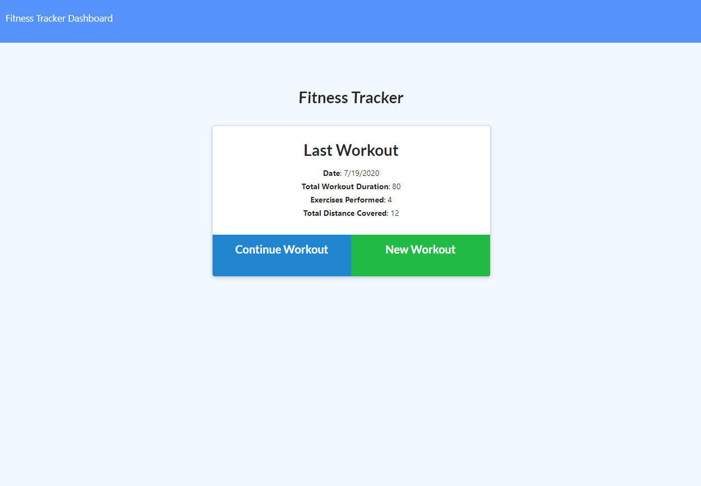
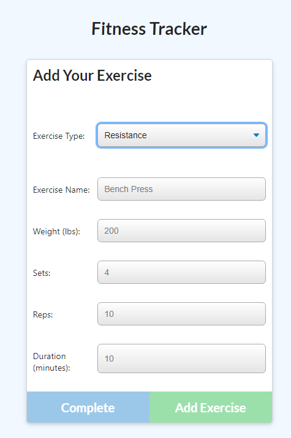

  # GetFitTrack
  
  ## Deployed Application
  
  * https://getfittrack.herokuapp.com/
  
---

  ## Github Repo
  
  * https://https://github.com/6ftdotexe/GetFitTrack
  
---
  
  
  
  ---

  ## Description
    - Track workouts

---
  ## Table of Contents
   - [Installation](#installation)
   - [Usage](#usage)
   - [Contributors](#contributors)
   - [Tests](#tests)
   - [Screenshots](#screenshots)
   - [Demo](#demo)
   - [Questions](#questions)
   - [License](#license)

 ---

  ## Installation
 
  - To install necessary dependencies, run the following command:

```
  npm start
```

---

  ## Usage
 The purpose of this app is to track workouts and see a overview of your previous workout progression

  ### User Story

```
  AS an Athlete 

  I WANT a Workout Tracker

  SO THAT I can Track my workouts
```

---

  ## Contributors

  - Lance Page

 ---
 
  ## Tests

  To run tests, run the following command:

```
  npm run test
  ```
  ---
  
  ## Screenshots
  
  ## 
  
  ## 
  
  ## 
  
  ---
  
  ## DEMO
  
  ## 
    
  ---
  
  ## Questions
  
  if you have questions please leave a comment.
  
  ---
  
   ## License

  This project is licensed under the ISC license.


